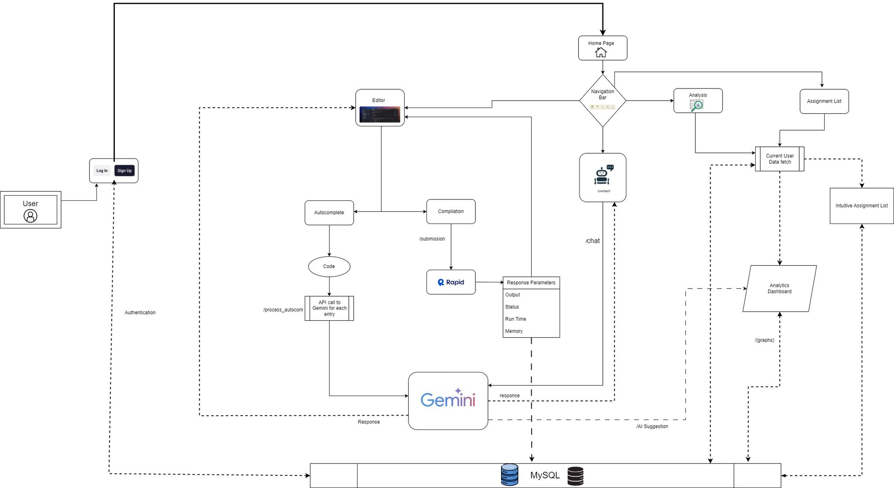

# DevHelp - A Coding Assistant

DevHelp is a concise and efficient assistant designed to aid developers in their coding endeavors. With DevHelp, programmers can quickly access documentation, troubleshoot errors, and find solutions to common coding challenges within the. Its user-friendly interface and comprehensive resources streamline the development process, empowering users to write clean, robust, and efficient code with ease.

## Demo:


## Flowchart:


## Key Features

- Support for Multiple Languages
- AI-Based Chatbot
- Smart Code Editor
- Dashboard Analytics
- Intuitive Assignment List
  
## Installation Steps

1. **Clone the Repository:**
   ```
   git clone https://github.com/techcodebhavesh/DevHelp.git
   ```

2. **Navigate to Project Directory:**
   ```
   cd devhelp
   ```

3. **Configure API and MySQL Credentials:**
   - Copy the `.env.example` file and rename it to `.env`.
   - Update the `.env` file with the credentials obtained from the respective services in the respective directories.

4. **Install Dependencies:**
    - To ensure all dependencies are installed correctly, navigate to the project's client and root directory and run the following command:
   ```
   npm install
   ```
4. **Fix for Legacy Peer Dependencies:**
    - If you encounter any issues related to legacy peer dependencies during the installation process, use the following command to install them:
   ```
   npm i --legacy-peer-deps
   ```

4. **Build the Project:**
   ```
   npm run build
   ```

5. **Set up MySQL for Authentication and Storage:**
   - Create a table named users, user_todos, graphs with the following schema:
   - CREATE TABLE users ( id INT AUTO_INCREMENT PRIMARY KEY, username VARCHAR(255) NOT NULL, password VARCHAR(255) NOT NULL, accepted INT, naccepted INT );
   - CREATE TABLE user_todos ( id INT AUTO_INCREMENT PRIMARY KEY, username VARCHAR(255) NOT NULL, password VARCHAR(255) NOTCREATE TABLE user_todos ( id INT AUTO_INCREMENT PRIMARY KEY, username VARCHAR(255) NOT NULL, todos TEXT NOT NULL, status VARCHAR(10) ); NULL, accepted INT, naccepted INT );
   - CREATE TABLE graphs ( username VARCHAR(255) NOT NULL, timestamp TIMESTAMP NOT NULL, memory INT, status VARCHAR(255), time DECIMAL(5, 3) );

6. **Start the Application:**
   - Within the project's main directory, execute the command:
   ```
   npm run start
   ```
